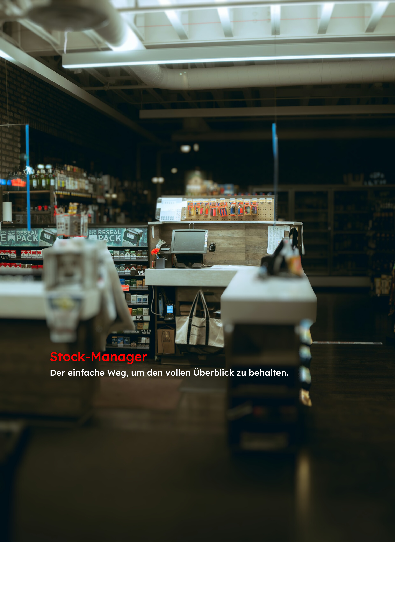

<!--
 ## Hi there 👋
-->

<!--    -->
<!-- </img> -->

<h1 align="center">Nima Mir Marashi</h1>

  <h5>
    <!-- <strong>Web Developer</strong>,  -->
    <strong>Warhammer 40k</strong> enthusiast by heart.
  </h5>

  <!-- Badges skills or interests -->
   <!--    -->
 

<h2>Try my latest <a href="https://www.nima-mm.de/projekte/">Projects</a>-Live:</h2> 
Ask me for the Credentials ORrRr find out :)

<a href="https://lagerkontrolle.nima-mm.com">
   

</a>
   <!--  -->

<!-- 
---

---

<!--

  <h2>About Me</h2>
  

    <em>
      Passionate about crafting sleek websites and immersive user experiences. 
      Whenever I'm not coding, I'm probably reading lore or painting minis in the Grim Darkness of the far future!
    </em>
  

---
-->

  <h5>GitHub Stats</h5>
  
  <!-- GitHub Stats Card -->
  <!--  -->
  
  <!-- Top Languages Card -->
  

---

  <h2>Get in Touch</h2>
  

    <a href="https://nima-mm.info">Website</a> •
    <a href="https://github.com/Nima-MM">GitHub</a> •
    <a href="mailto:marashi.nima@outlook.de">Email</a> •
    <a href="https://www.linkedin.com/in/nima-mm/">LinkedIn</a>
  

  <!-- Another optional Warhammer 40k or fun-themed GIF if you wish -->
  

<!--
**Nima-MM/Nima-MM** is a ✨ _special_ ✨ repository because its `README.md` (this file) appears on your GitHub profile.

Here are some ideas to get you started:

- 🔭 I’m currently working on ...
- 🌱 I’m currently learning ...
- 👯 I’m looking to collaborate on ...
- 🤔 I’m looking for help with ...
- 💬 Ask me about ...
- 📫 How to reach me: ...
- 😄 Pronouns: ...
- ⚡ Fun fact: ...
-->
